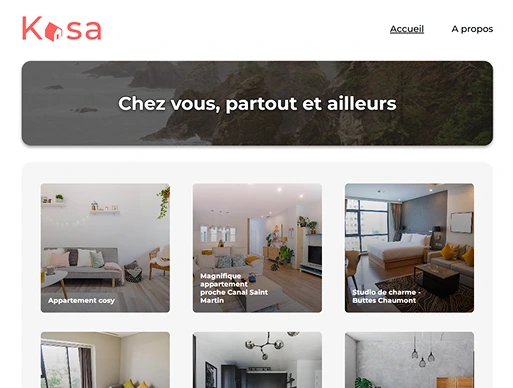
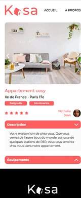

# Projet OC 5 - Kasa

<i>Travail réalisé lors de la formation "Développeur Web" d'OpenClassrooms.</i>


<p align="center">
  
  
</p>


## 🎞️ Scénario
<i>Vous êtes développeur front-end en freelance pour Kasa, une entreprise de location d’appartements entre particuliers.
Avec plus de 500 annonces postées chaque jour, Kasa fait partie des leaders de la location d’appartements entre particuliers en France.
L'occasion parfaite pour vous d'ajouter une belle référence à votre portfolio de freelance !</i>
<br><br>

## 🎯 Objectifs
- Initialiser une application avec **Vite**
- Configurer la navigation entre les pages de l'application avec **React Router**
- Développer des éléments de l'interface d'un site web grâce à des composants **React**
- Créer des composants réutilisables (**collapses, carrousel**)
- Gérer des erreurs de navigation avec une page 404
- Mettre en œuvre des animations CSS
- Développer une interface web avec **Sass** tout en respectant les maquettes **Figma**
<br><br>

## 💡 Technologies utilisées
- HTML5
- Sass
- React
<br><br>


## 📂 Structure
📁  OC_P5_Optimisation-KASA/kasa-app/
│── 📁 public/
│── 📁 src/
  │── 📁 assets/
  │── 📁 styles/
  │── 📁 data/
  │── 📁 components/
  │── 📁 pages/
│── appRouter.jsx
│── main.jsx
│── README.md
<br><br>

## 🚀 Installation
1. **Cloner** le dépôt GitHub :
   ```bash
   git clone https://github.com/HeleneC-cyber/OC_P5_Optimisation-KASA.git
2. **Naviguer** dans le répertoire du projet :
   ```bash
   cd OC_P5_Optimisation-KASA
3. **Installer les dépendances** :
4. **Lancer l'application** en mdoe développement :
   ```bash
   npm run dev
<br><br>


## 💻 Démonstration en ligne
👉 Voir le site en ligne [ICI](https://helenec-cyber.github.io/OC_P5_Optimisation-KASA/)
<br><br>

## 📝 Notes additionnelles
- Le projet met en avant les compétences de développement front-end : capacité à créer des interfaces respectant des spécifications techniques, esthétiques avec un design précis, répondant aux attentes du client.
- L'utilisation de Sass suit la logique des composants de React, en permettant l'importation uniquement du style nécessaire pour chaque composant, pour de meilleures performances, une meilleure lisibilité et maintenabilité.
<br><br>


## 📬 Contact
Pour toute question ou suggestion, n'hésitez pas à me contacter sur [LinkedIn](https://www.linkedin.com/in/helene-canovas-48710b141/)